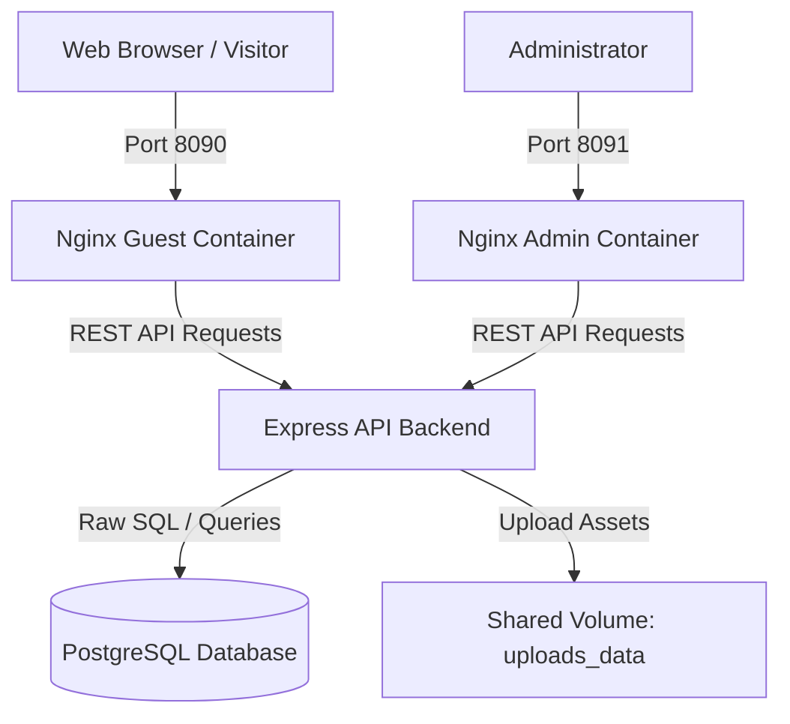

# Personal Portfolio Platform

A complete full-stack web application built to showcase projects, manage a professional resume, and organize skills. It includes a public guest portal, a secure admin dashboard, a RESTful API backend, and a PostgreSQL database. The entire ecosystem is containerized for seamless local development and production orchestration.

---

## System Architecture

The following diagram illustrates the workflow and container communication within the system:



---

## Tech Stack & Architecture Decisions

This project is built using a modern, performant, and type-safe stack designed to deliver a high-quality user experience:

### Frontend
*   **React 19 & TypeScript**: Chosen for modern component lifecycle management, state management, and type safety across pages.
*   **Vite**: Used as the frontend build tool for instant Hot Module Replacement (HMR) during development and highly optimized static bundles for production.
*   **Tailwind CSS v4**: Utility-first CSS framework for fast, consistent styling and clean visual design.
*   **Framer Motion**: Integrated to enable smooth fluid page transitions and interactive micro-animations that enhance visitor engagement.
*   **Lenis**: Integrated to manage smooth scrolling behavior across different device layouts.
*   **Nginx (Alpine)**: Lightweight, high-performance web server container configured to serve static assets and handle routing for single-page applications.

### Backend
*   **Express.js & TypeScript**: Node.js framework optimized for handling HTTP requests, routing, middleware, and business logic with strong type verification.
*   **PostgreSQL Client (pg)**: Standard PostgreSQL driver used with Raw SQL queries instead of an ORM. This ensures maximum execution performance and total control over relational database schemas and queries.
*   **Multer**: Handles file and image uploads for portfolio projects securely.
*   **Database Migrations**: Handled via custom built-in Node scripts to maintain schema consistency across environments.

### Infrastructure & Database
*   **PostgreSQL 15 (Alpine)**: Reliable, production-ready relational database to manage portfolio data.
*   **Docker & Docker Compose**: Used to orchestrate application services, ensuring that development and production environments remain completely identical and reproducible.

---

## Features

*   **Public Guest UI**: Responsive portfolio interface showcasing projects, bio, skills, and contact info with smooth animations.
*   **Admin Dashboard**: Secure control panel for managing portfolio items, uploading images, and editing categories.
*   **Dynamic Image Management**: API endpoints designed to parse and organize uploaded assets.
*   **Database Migrations**: Scripted database migrations for robust schema modifications and updates.

---

## Deployment & Setup Guide

This project is designed to run in containerized environments. Below is a guide on how to configure and deploy the services.

### Prerequisites
Make sure your deployment environment has the following installed:
*   Docker (v20.10 or higher)
*   Docker Compose (v2.0 or higher)

### Environment Configuration
The services rely on environment variables for database credentials and host bindings.

#### 1. Backend Configuration
Create an environment file (e.g., `.env`) in the `backend` directory. Do not expose production secrets in version control.
```env
PORT=5000
DATABASE_URL=postgresql://<DB_USER>:<DB_PASSWORD>@<DB_HOST>:<DB_PORT>/<DB_NAME>
```
*Note: In the default Docker Compose deployment, these variables are injected automatically via docker-compose configuration.*

#### 2. Frontend Build Modes
The frontend contains separate build commands for guest and admin viewports, configured through build arguments in Docker Compose:
*   `VITE_APP_MODE=guest` loads environment configurations for the public-facing application.
*   `VITE_APP_MODE=admin` loads environment configurations for the management dashboard.

### Run with Docker Compose

1. Clone the repository:
   ```bash
   git clone <REPOSITORY_URL>
   cd <REPOSITORY_FOLDER>
   ```

2. Build and start all services in detached mode:
   ```bash
   docker compose up -d --build
   ```
   This command starts the following containers:
   *   `gerson-postgres` (Database service)
   *   `gerson-backend` (REST API server)
   *   `gerson-frontend` (Visitor application)
   *   `gerson-frontend-admin` (Administrator application)
   *   `gerson-adminer` (Database web manager)

3. Run database migrations:
   To construct the database tables and apply the schema, run the migration command inside the backend container:
   ```bash
   docker compose exec backend npm run db:migrate:prod
   ```

---

## Access Points

After successful initialization, the following local access routes will be active:

| Service | Port | Description |
| :--- | :--- | :--- |
| **Guest Frontend** | `8090` | Public-facing portfolio page |
| **Admin Frontend** | `8091` | Admin dashboard panel |
| **Backend REST API** | `5000` | Node.js Express API server |
| **Adminer UI** | `8085` | Database interface client |

---

## Production Security Best Practices

When deploying to a public server:

1. **Reverse Proxy & SSL**: Bind a reverse proxy (such as Nginx or Caddy) on the host machine to handle SSL/TLS termination (HTTPS) and route traffic to the containerized ports (`8090` and `8091`).
2. **Access Control**: Keep ports like `8085` (Adminer) and `8091` (Admin Frontend) blocked from the public internet using firewall configurations (e.g., UFW). Ideally, access them only through a private VPN or use Nginx basic authentication.
3. **Secrets Management**: Replace default PostgreSQL credentials in `docker-compose.yml` with strong, randomly generated passwords before building the production image.
4. **Data Backups**: Regularly backup volume mounts `postgres_data` (for the database state) and `uploads_data` (for uploaded portfolio images).
