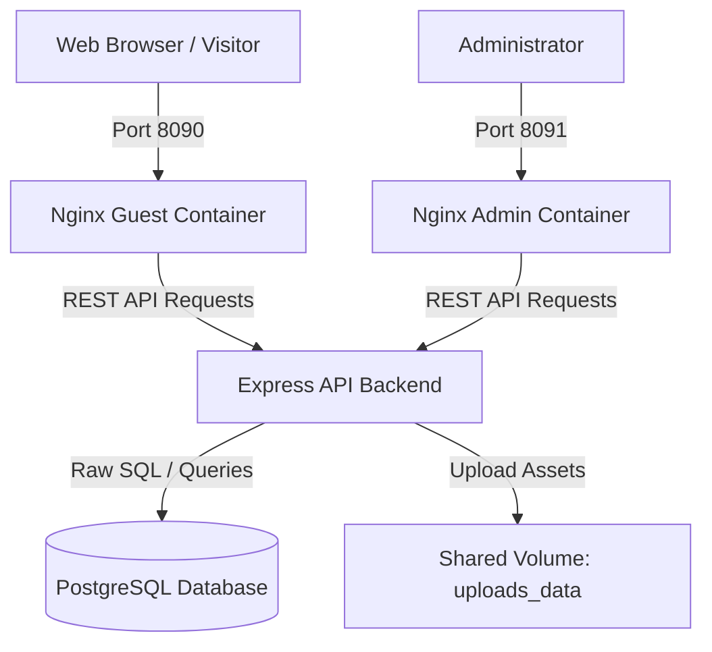

# Personal Portfolio Platform

A complete full-stack web application built to showcase projects, manage a professional resume, and organize skills. It includes a public guest portal, a secure admin dashboard, a RESTful API backend, and a PostgreSQL database. The entire ecosystem is containerized for seamless local development and production orchestration.

---

## System Architecture

The following diagram illustrates the workflow and container communication within the system:

---

## Tech Stack & Architecture Decisions

This project is built using a modern, performant, and type-safe stack designed to deliver a high-quality user experience:

### Frontend
*   **React 19 & TypeScript**: Chosen for modern component lifecycle management, state management, and type safety across pages.
*   **Vite**: Used as the frontend build tool for instant Hot Module Replacement (HMR) during development and highly optimized static bundles for production.
*   **Tailwind CSS v4**: Utility-first CSS framework for fast, consistent styling and clean visual design.
*   **Framer Motion**: Integrated to enable smooth fluid page transitions and interactive micro-animations that enhance visitor engagement.
*   **Lenis**: Integrated to manage smooth scrolling behavior across different device layouts.
*   **Nginx (Alpine)**: Lightweight, high-performance web server container configured to serve static assets and handle routing for single-page applications.

### Backend
*   **Express.js & TypeScript**: Node.js framework optimized for handling HTTP requests, routing, middleware, and business logic with strong type verification.
*   **PostgreSQL Client (pg)**: Standard PostgreSQL driver used with Raw SQL queries instead of an ORM. This ensures maximum execution performance and total control over relational database schemas and queries.
*   **Multer**: Handles file and image uploads for portfolio projects securely.
*   **Database Migrations**: Handled via custom built-in Node scripts to maintain schema consistency across environments.

### Infrastructure & Database
*   **PostgreSQL 15 (Alpine)**: Reliable, production-ready relational database to manage portfolio data.
*   **Docker & Docker Compose**: Used to orchestrate application services, ensuring that development and production environments remain completely identical and reproducible.

---

## Features

*   **Public Guest UI**: Responsive portfolio interface showcasing projects, bio, skills, and contact info with smooth animations.
*   **Admin Dashboard**: Secure control panel for managing portfolio items, uploading images, and editing categories.
*   **Dynamic Image Management**: API endpoints designed to parse and organize uploaded assets.
*   **Database Migrations**: Scripted database migrations for robust schema modifications and updates.

---

## Deployment Method

### How the Platform is Deployed
The entire platform is containerized using Docker and orchestrated using Docker Compose. This architecture divides the system into isolated, modular services:
*   **Database Service**: A PostgreSQL container handling relational data persistence.
*   **Backend API**: A Node.js container executing the Express server.
*   **Visitor Frontend**: An Nginx container serving the optimized visitor portfolio interface.
*   **Admin Frontend**: A separate Nginx container serving the administrative control panel.
*   **Database Management**: An Adminer container providing a secure web interface for data management.

These services run within a private virtual network, allowing them to communicate securely using internal service names while exposing only designated traffic ports to the host system.

### Why This Deployment Method is Used
This containerized deployment strategy was chosen to achieve industry-standard software delivery and operations practices:
*   **Environment Parity**: Containerization ensures the application runs identically across local development, staging, and live production environments, eliminating configuration drift.
*   **Process Isolation**: Separating the database, API server, and web servers into individual containers limits dependencies, improves security, and ensures a failure in one service does not crash the others.
*   **Simplified Infrastructure Management**: Rather than manually installing and configuring databases, Node.js runtimes, and Nginx servers on host machines, the complete system can be spun up or down predictably as code.
*   **Security Control**: Exposing only the necessary public-facing web servers while keeping the database and API communication internal reduces the network attack surface.

